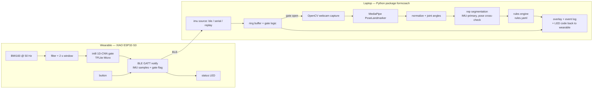

# 02 — System design (build specification)

This is the specification to build from. Where a value is marked **(default, calibrate)** it is a starting point to be tuned on data and recorded in `docs/DECISIONS.md`. Where something is marked **(verify)** it is an expectation about a third-party component that must be checked against the real thing.

## 1. Architecture



Two processes on the laptop are acceptable (IMU receiver thread + vision thread) but keep it one Python process with threads/asyncio; no message broker.

## 2. Firmware (PlatformIO, Arduino framework)

### 2.1 Responsibilities

1. Initialize BMI160 over I2C (400 kHz), accelerometer ±8 g, gyroscope ±1000 dps, ODR 100 Hz internally, decimated/averaged to **50 Hz** output.
2. Maintain a ring buffer of the last 2 s (100 samples × 6 channels, int16).
3. Every 0.5 s run the gate model on the last 2 s window (after the same preprocessing used in training: per-channel scaling constants baked into firmware from `model/preprocess.json`).
4. Apply hysteresis (§6.4) → `gate_state` ∈ {0 idle, 1 active}.
5. Stream samples over BLE in batches (§3). Also expose the same CSV over USB serial when connected (`--source serial` in dev).
6. Button (D1): short press toggles a **session** (starts/stops streaming and increments `session_id`); long press (2 s) triggers a 3-second **calibration** capture (device flat and still; store gravity vector and gyro bias in NVS).
7. LED (built-in, active-low GPIO21 **(verify)**): off = idle, slow blink = advertising, solid = connected+session, fast double-blink = "fault" code received from laptop, triple-blink = "good rep".
8. Power: light sleep between samples is optional; deep sleep after 10 min without a session (wake on button). Report battery voltage if a divider is added later (not in v1; no ADC pin is wired).

### 2.2 Libraries

- `h2zero/NimBLE-Arduino` for BLE (lower RAM than Bluedroid).
- BMI160: `hanyazou/BMI160-Arduino` (fork of the Intel CurieIMU driver) or `DFRobot_BMI160`. Pick one, record in DECISIONS. GY-BMI160 modules usually answer at I2C address **0x69** (SA0 high) — scan on first boot and log **(verify)**.
- TFLite Micro: prefer the `Chirale_TensorFlowLite` Arduino library (official TFLM Arduino port); alternatives are `tanakamasayuki/TensorFlowLite_ESP32` or an Edge Impulse-exported Arduino library. Compile-test all three candidates early in CI and choose the first that builds cleanly for `seeed_xiao_esp32s3` **(verify)**.

### 2.3 Pin map (XIAO ESP32-S3)

| Function | XIAO label | GPIO | Notes |
|---|---|---|---|
| I2C SDA | D4 | GPIO5 | default `Wire` SDA **(verify in board variant)** |
| I2C SCL | D5 | GPIO6 | default `Wire` SCL |
| Button | D1 | GPIO2 | `INPUT_PULLUP`, pressed = LOW, 30 ms debounce |
| User LED | built-in | GPIO21 | active-low **(verify)** |
| Battery | BAT+/BAT− pads | — | through slide switch; onboard charger 100 mA |

`platformio.ini` starting point:

```ini
[env:xiao_esp32s3]
platform = espressif32
board = seeed_xiao_esp32s3
framework = arduino
monitor_speed = 115200
build_flags = -DCORE_DEBUG_LEVEL=1 -DFORMCOACH_FW_VERSION=\"0.1.0\"
lib_deps =
  h2zero/NimBLE-Arduino
  ; BMI160 + TFLM libraries per DECISIONS.md
```

## 3. BLE protocol

- Device name `FormCoach-<last 4 hex of MAC>`; advertise the service UUID so the laptop can filter.
- **Service** `7a0c0001-4e1e-4b9a-9a1c-0f0c0c0c0001`
- **IMU characteristic** (notify) `7a0c0002-…-0001`: batches of **5 samples** (100 ms) per notification.
- **Control characteristic** (write) `7a0c0003-…-0001`: 1-byte commands from laptop: `0x01` LED "good rep", `0x02` LED "fault", `0x03` start session, `0x04` stop session, `0x05` request calibration, `0x10` ping.
- **Status characteristic** (read/notify) `7a0c0004-…-0001`: firmware version, session_id, gate_state, uptime, calibration flag.
- Request MTU 185 on connect; a 5-sample batch is 5 × 17 + 4 = 89 bytes.

Sample packet layout (little-endian), defined once in `firmware/include/protocol.h` and mirrored by `src/formcoach/io/protocol.py` with a round-trip test:

| Field | Type | Meaning |
|---|---|---|
| `t_ms` | uint32 | device millis at sample |
| `ax, ay, az` | int16 ×3 | raw accel LSB (±8 g → 4096 LSB/g) |
| `gx, gy, gz` | int16 ×3 | raw gyro LSB (±1000 dps → 32.8 LSB/dps) |
| `flags` | uint8 | bit0 gate_state, bit1 session_active, bit2 button_pressed, bit3 calibrated |
| `seq` | uint16 | rolling sample counter (detect drops) |

Batch header: `session_id` (uint16), `n` (uint8), `reserved` (uint8). The laptop converts LSB to SI units (m/s², rad/s) on receipt and timestamps arrival for latency measurement; device `t_ms` is the ordering clock.

## 4. Laptop application (`formcoach` package)

### 4.1 IMU sources (`io/`)

All implement `IMUSource.iter_samples() -> Iterator[Sample]` with the same dataclass so the pipeline is source-agnostic:

- `BLESource(name_prefix="FormCoach")` via `bleak` (Linux/macOS/Windows). Reconnect with backoff; log drop counts from `seq`.
- `SerialSource(port, baud=115200)` via `pyserial`; same CSV lines the firmware prints.
- `ReplaySource(session_dir | dataset stream, speed=1.0)` replays a Parquet/CSV stream in real time or as fast as possible (`speed=0`). MM-Fit smartwatch streams must be replayable so the full pipeline runs with **no hardware**.
- `SessionRecorder` writes `data/team/<S#>/<session_id>/imu.parquet` (+ `video.mp4` and `pose.parquet` when the camera is on) and a `meta.json` (subject code, exercise, camera id, firmware version, notes).

### 4.2 Gate logic on the laptop

Two gate implementations, selectable by flag, so the on-device model can be compared to laptop-side gating and to always-on:

- `device`: trust `flags.gate_state` from the wearable.
- `laptop`: run the same window model (float) on the laptop from the raw stream.
- `always_on`: camera always processed (the baseline).
- `energy`: motion-energy threshold on |a| variance (the simplest baseline).

Open camera when gate active for **2 consecutive windows**; close after **6 s** idle **(default, calibrate)**. Log every frame as `processed` or `skipped` with timestamps — this is the data for the efficiency claim.

### 4.3 Vision (`pose/`)

- OpenCV capture at 640×480 or 1280×720, 30 fps target; MediaPipe Tasks `PoseLandmarker` in `LIVE_STREAM` mode with the **Lite** model first (`pose_landmarker_lite.task`); models downloaded by `make setup` into `models/`.
- Per frame store image landmarks (x, y normalized, z, visibility) for the overlay and **world landmarks** (meters, hip-centered) for angle computation.
- Normalization for camera independence: use world landmarks; additionally scale by torso length (mid-shoulder to mid-hip) so thresholds expressed in "torso units" are comparable across people.
- Drop frames where any landmark required by the active exercise has visibility < 0.5 **(default, calibrate)**; interpolate gaps ≤ 3 frames, otherwise mark segment invalid.
- Smoothing: 5-frame median then Savitzky–Golay (window 7, order 2) on angle series.

Joint angles (degrees, from world landmarks; MediaPipe indices in parentheses):
- elbow: shoulder(11/12)–elbow(13/14)–wrist(15/16)
- shoulder abduction: hip(23/24)–shoulder(11/12)–wrist(15/16)
- shoulder flexion (sagittal): angle between upper arm and trunk vector projected on sagittal plane
- hip: shoulder–hip–knee(25/26); knee: hip–knee–ankle(27/28)
- trunk inclination: angle between mid-hip→mid-shoulder vector and vertical (world y)
- knee tracking (frontal): horizontal offset knee x − ankle x, in torso units

### 4.4 Rep segmentation (`signal/reps.py`, `pose/reps.py`)

- IMU-primary: band-pass 0.3–3 Hz on the dominant axis (choose per window by max variance, or use |a| minus gravity), `scipy.signal.find_peaks` with prominence ≥ 0.15 g and min distance 0.8 s **(default, calibrate)**; rep = interval between successive troughs around a peak.
- Pose cross-check: rep = one excursion of the primary joint angle beyond `start` and back (curl: elbow < 60° then > 150°). Fusion rule: a rep counts when the IMU rep overlaps a pose rep by ≥ 50 %; unmatched IMU reps in a visible window are logged for error analysis.
- Each rep is resampled to 30 time steps for rules and reporting: `rep_id, t_start, t_end, duration_s, angles[30 × k], features`.

### 4.5 Rules engine (`rules/`)

Config-driven (`rules.yaml`), multi-label per rep, every rule outputs `{code, severity, value, threshold, message}`. See §7 for the exercise catalog. The engine must be unit-tested with synthetic angle sequences (perturb a correct rep and assert the right code fires).

### 4.6 Feedback and UI (`app/`)

- v0: OpenCV window with skeleton, rep counter, exercise name, last fault text; keyboard shortcuts for exercise select (1–4), start/stop, quit.
- Send `0x01`/`0x02` to the wearable on each rep; log `t_rep_end` (IMU clock mapped to laptop clock) and `t_feedback` for latency.
- Session log: `events.parquet` (rep and fault events) + `frames.parquet` (processed/skipped) + `session.json` summary.
- v1: Streamlit page to open a session folder and show rep timeline, fault distribution, angle curves, gating timeline.

## 5. Data schema (common across datasets)

`IMUStream` Parquet columns: `dataset, subject, session, device, placement, t (float s, monotonic), ax, ay, az (m/s²), gx, gy, gz (rad/s), exercise (str or "idle"), rep_id (int, −1 if none), set_id`.

`Window` Parquet (after `features build`): `dataset, subject, session, device, window_id, t_start, t_end, label_exercise, label_active (0/1), feat_* (engineered), x (list[100×6] float32 as fixed-shape array column)`.

`Pose` Parquet: `session, frame, t, lm_{i}_{x|y|z|v}` (33 image landmarks), `wl_{i}_{x|y|z}` (33 world landmarks), `valid (bool)`.

`Rep` Parquet: `session, subject, exercise, rep_id, t_start, t_end, duration_s, source (imu|pose|fused), angles (30×k), faults (list[str]), metrics (json)`.

Placement vocabulary: `wrist_l, wrist_r, upper_arm, pocket, ear` — used to filter and to weight augmentation.

## 6. Gate / exercise-recognition model

### 6.1 Inputs

2 s windows at 50 Hz, 6 channels, per-channel standardization with constants from the training set (stored in `model/preprocess.json` and compiled into firmware). Optional 7th channel |a| (helps orientation invariance); decide by ablation.

### 6.2 Architectures compared

1. **Baseline:** motion-energy threshold on the variance of |a| over the window (one tunable parameter).
2. **Random forest** (scikit-learn) on ~30 hand-crafted features per window (mean, std, min, max, energy, dominant frequency, spectral entropy, autocorrelation peak lag/height per channel and for |a|).
3. **1D-CNN** (Keras): `Conv1D(16,5) → ReLU → MaxPool(2) → Conv1D(32,5) → ReLU → MaxPool(2) → Conv1D(32,3) → ReLU → GlobalAvgPool → Dense(n_classes)`; ~10 k parameters; two heads or two models: `active` (binary) and `exercise` (multi-class over the RecoFit classes mapped to our four + "other"). Train with class weights, Adam, early stopping on LOSO validation folds; augmentation: random 3-D rotation of the accel/gyro triplets (± 30°), time-warp (± 10 %), jitter (σ = 0.05 g), magnitude scaling (± 10 %).

### 6.3 Quantization and deployment

Post-training int8 (full integer, representative dataset ≥ 500 windows); report the float→int8 drop; if > 2 points macro-F1, use quantization-aware training. Export `.tflite` → `xxd -i` → `gate_model_data.cc`. Target arena ≤ 40 KB, inference < 20 ms on the ESP32-S3 at 240 MHz **(verify)**.

### 6.4 Hysteresis

`active` if the model says active for 2 consecutive windows (1.0 s); `idle` after 12 consecutive idle windows (6 s). Both constants live in `protocol.h`/`preprocess.json` and in `rules.yaml` for the laptop-side gate so experiments can sweep them.

## 7. Form rules catalog (v1, four exercises)

Angles from world landmarks; "torso" = mid-shoulder to mid-hip distance. All thresholds **(default, calibrate)** on MM-Fit correct-form reps: set each threshold at the 5th/95th percentile of the correct-form distribution, then verify with perturbation tests.

| Exercise | Primary angle (rep) | Fault code | Rule |
|---|---|---|---|
| Bicep curl | elbow flexion; rep = min < 60°, return > 150° | `CURL_PARTIAL_ROM` | min elbow angle > 75° or max < 140° |
| | | `CURL_SWING` | upper-arm to trunk angle deviates > 20° from its start value during the rep, or elbow moves > 0.15 torso horizontally |
| | | `CURL_TOO_FAST` | rep duration < 1.0 s |
| | | `CURL_ASYMMETRY` | left/right min-angle difference > 20° (two-arm curls only) |
| Overhead press | elbow angle; rep = bottom < 90°, top > 160° | `PRESS_NO_LOCKOUT` | max elbow angle < 155° |
| | | `PRESS_TRUNK_LEAN` | trunk inclination > 15° from vertical at any point |
| | | `PRESS_ASYMMETRY` | left/right elbow angle differ > 20° at top |
| | | `PRESS_TOO_FAST` | rep duration < 1.0 s |
| Lateral raise | shoulder abduction; rep = peak > 75° | `RAISE_OVER` | peak abduction > 100° |
| | | `RAISE_PARTIAL` | peak abduction < 65° |
| | | `RAISE_BENT_ELBOW` | elbow angle < 140° at peak |
| | | `RAISE_TOO_FAST` | rep duration < 1.0 s |
| Squat | knee angle; rep = min < 100° | `SQUAT_SHALLOW` | min knee angle > 110° or hip y not below knee y at bottom |
| | | `SQUAT_FORWARD_LEAN` | trunk inclination > 45° at bottom |
| | | `SQUAT_KNEE_VALGUS` | knee x inside ankle x by > 0.10 torso at bottom (frontal view only) |
| | | `SQUAT_TOO_FAST` | rep duration < 1.2 s |

Each fault has a one-sentence coaching message in `rules.yaml` (e.g. `CURL_SWING: "Keep your upper arm still — the elbow is drifting forward."`). Messages are plain templates; an LLM layer is a stretch goal.

## 8. Evaluation harness (`eval/`)

All commands write Markdown tables + PNG figures under `reports/` and are invoked by `make eval`:

- `eval loso --model {energy,rf,cnn,cnn-int8} --dataset recofit` → accuracy, macro-F1, confusion matrix per fold and pooled; also `--train recofit --test mmfit` cross-dataset.
- `eval repcount --source {imu,pose,fused,peaks}` on MM-Fit → MAE and % sets exactly right, per exercise.
- `eval rules` → correct-form pass rate per rule on MM-Fit; perturbation table (apply each of: scale ROM ×0.7, add 25° trunk lean, speed ×2, shift elbow 0.2 torso) and report detection rate per rule.
- `eval gating --gate {always_on,energy,laptop,device}` on recorded sessions → frames processed %, mean CPU % (psutil), wall time, and an assertion that rep/fault events match the always-on run (report any mismatch).
- `eval pose-ablation --model {lite,full,heavy,yolo11n}` → rep-segmentation agreement with MM-Fit, FPS, CPU %.
- `eval latency` on live/replay sessions → distribution of rep-end → feedback.
- `eval device` reads a firmware log → inference ms, arena bytes, flash bytes; battery test procedure documented and results entered manually.
- `eval transfer` → public-trained models evaluated on `data/team/` recordings, before/after last-layer fine-tuning on one subject.

## 9. Fallback: PocketTrainer (do not build unless told)

If the vision path underperforms by the Phase 3 go/no-go (~Nov 3), the deliverable becomes **PocketTrainer**: the same wearable, no camera. The int8 model on the ESP32-S3 classifies ~8 exercises (RecoFit classes), counts reps on-device with class-conditioned peak detection, and flags tempo and range-of-motion faults from IMU features; results stream over BLE to the laptop dashboard. Evaluation: LOSO accuracy/macro-F1 on RecoFit, rep MAE on MM-Fit, on-device latency/RAM/flash/battery, float→int8 drop; baselines: RF on hand-crafted features, peak-detection counting, float model on laptop, published RecoFit results. Everything in §§2–6 and §8 is reused; only §4.3–4.5 and §7 are dropped and a small on-device rep counter is added. Keep this reuse in mind when structuring code (the IMU path must not import the vision path).
