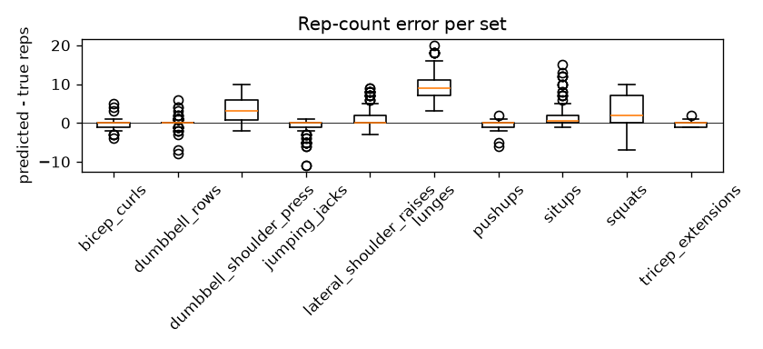

# Rep-count baseline (peak detection on MM-Fit smartwatch streams)

Generated by `formcoach eval repcount --source peaks` on 2026-09-24 16:20 · formcoach 0.1.0 · commit `033e70d` · seed 20260924

_Do not edit: regenerate with the command above (CLAUDE.md rule 3)._

- **method:** band-pass 0.3-3.0 Hz, mode=axis, prominence 0.15 g, min distance 0.8 s (docs/02 §4.4 defaults)
- **devices:** sw_l, sw_r
- **sets:** 1232

## Per canonical exercise

| exercise | n_sets | mae | bias | exact_pct | within1_pct |
|---|---|---|---|---|---|
| curl | 118 | 0.69 | -0.39 | 50.00 | 89.83 |
| other | 754 | 2.31 | 1.57 | 46.02 | 72.41 |
| press | 120 | 3.66 | 3.49 | 17.50 | 35.00 |
| raise | 112 | 1.87 | 1.46 | 38.39 | 66.96 |
| squat | 128 | 3.71 | 3.10 | 22.66 | 40.62 |
| all | 1232 | 2.39 | 1.72 | 40.50 | 66.64 |

## Per MM-Fit activity

| activity | n_sets | mae | bias | exact_pct | within1_pct |
|---|---|---|---|---|---|
| bicep_curls | 118 | 0.69 | -0.39 | 50.00 | 89.83 |
| dumbbell_rows | 128 | 0.60 | 0.13 | 66.41 | 89.84 |
| dumbbell_shoulder_press | 120 | 3.66 | 3.49 | 17.50 | 35.00 |
| jumping_jacks | 114 | 1.23 | -1.12 | 50.00 | 75.44 |
| lateral_shoulder_raises | 112 | 1.87 | 1.46 | 38.39 | 66.96 |
| lunges | 124 | 9.35 | 9.35 | 0.00 | 0.00 |
| pushups | 130 | 0.54 | -0.42 | 54.62 | 96.92 |
| situps | 130 | 1.85 | 1.73 | 43.85 | 70.77 |
| squats | 128 | 3.71 | 3.10 | 22.66 | 40.62 |
| tricep_extensions | 128 | 0.41 | -0.30 | 60.16 | 99.22 |
| all | 1232 | 2.39 | 1.72 | 40.50 | 66.64 |

## Per device

| device | n_sets | mae | bias | exact_pct | within1_pct |
|---|---|---|---|---|---|
| sw_l | 616 | 2.52 | 1.86 | 38.80 | 65.42 |
| sw_r | 616 | 2.26 | 1.58 | 42.21 | 67.86 |
| all | 1232 | 2.39 | 1.72 | 40.50 | 66.64 |

