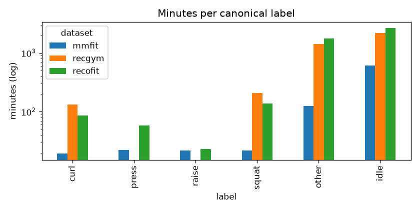
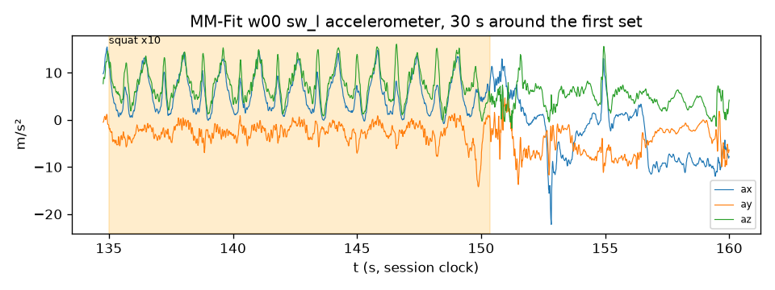

# Data profile

Generated by `formcoach data profile` on 2026-09-24 16:07 · formcoach 0.1.0 · commit `4b6621e` · seed 20260924

_Do not edit: regenerate with the command above (CLAUDE.md rule 3)._

Datasets present: mmfit, recofit, recgym. Raw roots are gitignored; run `make data DATASET=<name>` to fetch.

## MM-Fit

- workouts: 21 · subjects: 10 · labelled minutes: 209.8
- missing modalities: w00: sp_l, w01: sp_l, w02: sp_l, w04: sp_l, w05: sp_l, w07: sp_l, w09: sp_l, w10: sp_l, w11: sp_l, w12: sp_l, w15: sp_l, w16: sp_l, w18: sp_l, w19: sp_l, w20: sp_l

| device | placement | workouts | minutes | rate_hz | duplicate_ts |
|---|---|---|---|---|---|
| sw_l | wrist_l | 21 | 823.1 | 103.2 | 20945 |
| sw_r | wrist_r | 21 | 823.1 | 104.1 | 27535 |
| eb_l | ear | 21 | 823.1 | 84.8 | 1163923 |
| sp_r | pocket | 21 | 823.1 | 212.4 | 1052285 |
| sp_l | pocket | 6 | 204.8 | 500.0 | 347712 |

| label | sets | reps |
|---|---|---|
| curl | 59 | 599 |
| press | 60 | 598 |
| raise | 56 | 559 |
| squat | 64 | 639 |
| other | 377 | 3765 |

## RecoFit

- subjects: 94 · visits: 126 · hours: 79.4 · rate: 50.0 Hz · activity labels: 75 · junk-labelled minutes (dropped): 77.7
- single-activity file: 4687 recordings, cell matrix [94, 75]

| label | minutes |
|---|---|
| curl | 85.6 |
| idle | 2642.2 |
| other | 1744.3 |
| press | 58.5 |
| raise | 23.4 |
| squat | 137.6 |

## RecGym

- rows: 4,703,320 · subjects: 10 · sessions: 50 · positions: leg, pocket, wrist · rate: 20.0 Hz · hours: 65.3
- units: normalized [0,1]; no timestamps (value range [0.0, 1.0]) — see ADR-0014

| workout | minutes |
|---|---|
| Adductor | 120.9 |
| ArmCurl | 133.0 |
| BenchPress | 118.0 |
| LegCurl | 114.8 |
| LegPress | 138.2 |
| Null | 2172.6 |
| Riding | 219.3 |
| RopeSkipping | 44.3 |
| Running | 179.4 |
| Squat | 209.8 |
| StairClimber | 233.3 |
| Walking | 235.9 |

## Minutes per canonical label

| dataset | label | minutes | sets |
|---|---|---|---|
| mmfit | curl | 19.4 | 59 |
| mmfit | press | 22.5 | 60 |
| mmfit | raise | 21.8 | 56 |
| mmfit | squat | 21.9 | 64 |
| mmfit | other | 124.3 | 377 |
| mmfit | idle | 613.3 | 0 |
| recofit | curl | 85.6 |  |
| recofit | press | 58.5 |  |
| recofit | raise | 23.4 |  |
| recofit | squat | 137.6 |  |
| recofit | other | 1744.3 |  |
| recofit | idle | 2642.2 |  |
| recgym | curl | 133.0 |  |
| recgym | press | 0.0 |  |
| recgym | raise | 0.0 |  |
| recgym | squat | 209.8 |  |
| recgym | other | 1404.1 |  |
| recgym | idle | 2172.6 |  |

## MM-Fit example

