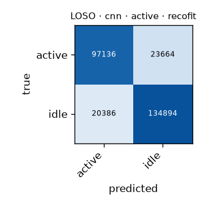

# LOSO · cnn · active · recofit

Generated by `formcoach eval loso --model cnn --dataset recofit --task active --folds 5` on 2026-09-27 20:17 · formcoach 0.1.0 · commit `9e7f8d2` · seed 20260924

_Do not edit: regenerate with the command above (CLAUDE.md rule 3)._

- **model:** cnn
- **task:** active
- **dataset:** recofit
- **windows:** 276,080 (label purity ≥ 0.8)
- **subjects:** 94
- **class balance:** idle: 155,280, active: 120,800
- **folds:** 5 subject-grouped folds

## Pooled (unseen-subject)

- accuracy **0.840** · macro-F1 **0.837** · windows 276,080 · folds 5
- per-fold macro-F1: mean 0.838, median 0.829, min 0.828

## Confusion matrix (pooled over folds)

| true \ predicted | active | idle |
|---|---|---|
| active | 97136 | 23664 |
| idle | 20386 | 134894 |

## Per fold

| fold | n_test | accuracy | macro_f1 |
|---|---|---|---|
| fold0 | 64824 | 0.848 | 0.846 |
| fold1 | 45656 | 0.834 | 0.829 |
| fold2 | 58927 | 0.830 | 0.828 |
| fold3 | 60144 | 0.831 | 0.829 |
| fold4 | 46529 | 0.862 | 0.857 |
