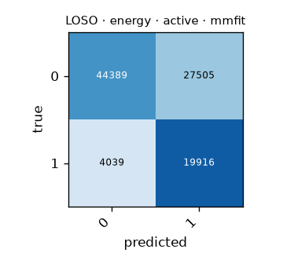

# LOSO · energy · active · mmfit

Generated by `formcoach eval loso --model energy --dataset mmfit --task active --folds loso` on 2026-09-24 16:23 · formcoach 0.1.0 · commit `033e70d` · seed 20260924

_Do not edit: regenerate with the command above (CLAUDE.md rule 3)._

- **model:** energy
- **task:** active
- **dataset:** mmfit
- **windows:** 95,849 (label purity ≥ 0.8)
- **subjects:** 10
- **class balance:** 0: 71,894, 1: 23,955
- **folds:** leave-one-subject-out

## Pooled (unseen-subject)

- accuracy **0.671** · macro-F1 **0.648** · windows 95,849 · folds 10
- per-fold macro-F1: mean 0.639, median 0.662, min 0.565

## Confusion matrix (pooled over folds)

| true \ predicted | 0 | 1 |
|---|---|---|
| 0 | 44389 | 27505 |
| 1 | 4039 | 19916 |

## Per fold

| fold | n_test | accuracy | macro_f1 |
|---|---|---|---|
| P0 | 24254 | 0.625 | 0.618 |
| P1 | 27819 | 0.697 | 0.676 |
| P2 | 7813 | 0.593 | 0.580 |
| P3 | 4420 | 0.750 | 0.678 |
| P4 | 5127 | 0.696 | 0.664 |
| P5 | 5004 | 0.617 | 0.587 |
| P6 | 4152 | 0.692 | 0.678 |
| P7 | 7862 | 0.765 | 0.686 |
| P8 | 3319 | 0.568 | 0.565 |
| P9 | 6079 | 0.722 | 0.660 |
