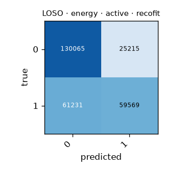

# LOSO · energy · active · recofit

Generated by `formcoach eval loso --model energy --dataset recofit --task active --folds loso` on 2026-09-24 16:21 · formcoach 0.1.0 · commit `033e70d` · seed 20260924

_Do not edit: regenerate with the command above (CLAUDE.md rule 3)._

- **model:** energy
- **task:** active
- **dataset:** recofit
- **windows:** 276,080 (label purity ≥ 0.8)
- **subjects:** 94
- **class balance:** 0: 155,280, 1: 120,800
- **folds:** leave-one-subject-out

## Pooled (unseen-subject)

- accuracy **0.687** · macro-F1 **0.665** · windows 276,080 · folds 94
- per-fold macro-F1: mean 0.639, median 0.632, min 0.398

## Confusion matrix (pooled over folds)

| true \ predicted | 0 | 1 |
|---|---|---|
| 0 | 130065 | 25215 |
| 1 | 61231 | 59569 |

## Per fold

| fold | n_test | accuracy | macro_f1 |
|---|---|---|---|
| R10001 | 1587 | 0.679 | 0.645 |
| R10002 | 3430 | 0.557 | 0.556 |
| R10003 | 1325 | 0.777 | 0.722 |
| R10004 | 5028 | 0.695 | 0.695 |
| R10005 | 5298 | 0.770 | 0.763 |
| R10006 | 1262 | 0.715 | 0.696 |
| R13 | 1210 | 0.591 | 0.577 |
| R15 | 1925 | 0.541 | 0.470 |
| R17 | 2096 | 0.736 | 0.722 |
| R201 | 2359 | 0.646 | 0.568 |
| R203 | 2333 | 0.697 | 0.627 |
| R216 | 2452 | 0.498 | 0.482 |
| R218 | 2323 | 0.645 | 0.526 |
| R223 | 2047 | 0.618 | 0.501 |
| R224 | 2697 | 0.575 | 0.456 |
| R228 | 2046 | 0.542 | 0.499 |
| R229 | 1921 | 0.650 | 0.590 |
| R23 | 7710 | 0.779 | 0.725 |
| R230 | 2096 | 0.657 | 0.637 |
| R231 | 2982 | 0.790 | 0.787 |
| R232 | 1889 | 0.480 | 0.435 |
| R233 | 2173 | 0.684 | 0.634 |
| R235 | 2143 | 0.640 | 0.570 |
| R236 | 1515 | 0.613 | 0.603 |
| R238 | 2439 | 0.651 | 0.587 |
| R239 | 1341 | 0.532 | 0.456 |
| R240 | 1708 | 0.670 | 0.648 |
| R241 | 2307 | 0.687 | 0.604 |
| R242 | 1792 | 0.571 | 0.542 |
| R244 | 1640 | 0.577 | 0.554 |
| R246 | 1847 | 0.613 | 0.579 |
| R247 | 3867 | 0.713 | 0.692 |
| R248 | 5929 | 0.602 | 0.599 |
| R252 | 1315 | 0.538 | 0.516 |
| R253 | 1270 | 0.644 | 0.637 |
| R28 | 1974 | 0.605 | 0.569 |
| R3 | 10957 | 0.702 | 0.697 |
| R31 | 2147 | 0.638 | 0.588 |
| R454 | 3632 | 0.760 | 0.760 |
| R502 | 5917 | 0.755 | 0.751 |
| R506 | 1807 | 0.708 | 0.644 |
| R509 | 5433 | 0.678 | 0.657 |
| R512 | 4004 | 0.695 | 0.684 |
| R517 | 1967 | 0.620 | 0.555 |
| R525 | 7063 | 0.624 | 0.609 |
| R526 | 5089 | 0.762 | 0.750 |
| R528 | 3159 | 0.582 | 0.510 |
| R530 | 1642 | 0.630 | 0.627 |
| R531 | 2624 | 0.627 | 0.548 |
| R532 | 2492 | 0.697 | 0.636 |
| R533 | 3085 | 0.601 | 0.579 |
| R534 | 3041 | 0.645 | 0.625 |
| R535 | 2844 | 0.677 | 0.624 |
| R536 | 5931 | 0.753 | 0.739 |
| R537 | 2705 | 0.628 | 0.617 |
| R539 | 964 | 0.519 | 0.398 |
| R541 | 2146 | 0.612 | 0.608 |
| R542 | 2836 | 0.745 | 0.710 |
| R543 | 6034 | 0.717 | 0.710 |
| R545 | 2132 | 0.724 | 0.711 |
| R546 | 2238 | 0.654 | 0.619 |
| R547 | 2497 | 0.753 | 0.726 |
| R549 | 2457 | 0.837 | 0.836 |
| R550 | 2511 | 0.680 | 0.668 |
| R551 | 2527 | 0.614 | 0.583 |
| R555 | 2253 | 0.690 | 0.668 |
| R556 | 2521 | 0.716 | 0.703 |
| R559 | 2024 | 0.764 | 0.761 |
| R560 | 4048 | 0.720 | 0.715 |
| R561 | 1992 | 0.620 | 0.610 |
| R564 | 2211 | 0.845 | 0.842 |
| R567 | 2473 | 0.746 | 0.710 |
| R570 | 4485 | 0.826 | 0.822 |
| R575 | 1520 | 0.795 | 0.795 |
| R576 | 2965 | 0.673 | 0.673 |
| R579 | 5653 | 0.780 | 0.776 |
| R590 | 2511 | 0.810 | 0.809 |
| R62 | 2535 | 0.692 | 0.613 |
| R64 | 2502 | 0.609 | 0.556 |
| R66 | 2623 | 0.684 | 0.630 |
| R67 | 2709 | 0.794 | 0.667 |
| R69 | 1860 | 0.622 | 0.584 |
| R71 | 2710 | 0.714 | 0.563 |
| R72 | 1574 | 0.682 | 0.649 |
| R73 | 2034 | 0.507 | 0.485 |
| R74 | 2101 | 0.728 | 0.620 |
| R75 | 1850 | 0.765 | 0.699 |
| R76 | 6171 | 0.706 | 0.643 |
| R77 | 2118 | 0.806 | 0.757 |
| R80 | 1803 | 0.773 | 0.732 |
| R81 | 9806 | 0.602 | 0.573 |
| R82 | 2634 | 0.818 | 0.804 |
| R83 | 2248 | 0.638 | 0.557 |
| R84 | 2989 | 0.863 | 0.762 |
