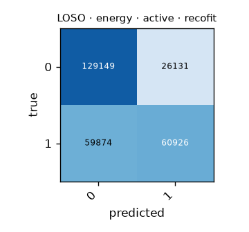

# LOSO · energy · active · recofit

Generated by `formcoach eval loso --model energy --dataset recofit --task active --folds 5` on 2026-09-27 20:17 · formcoach 0.1.0 · commit `9e7f8d2` · seed 20260924

_Do not edit: regenerate with the command above (CLAUDE.md rule 3)._

- **model:** energy
- **task:** active
- **dataset:** recofit
- **windows:** 276,080 (label purity ≥ 0.8)
- **subjects:** 94
- **class balance:** 0: 155,280, 1: 120,800
- **folds:** 5 subject-grouped folds

## Pooled (unseen-subject)

- accuracy **0.688** · macro-F1 **0.668** · windows 276,080 · folds 5
- per-fold macro-F1: mean 0.667, median 0.670, min 0.640

## Confusion matrix (pooled over folds)

| true \ predicted | 0 | 1 |
|---|---|---|
| 0 | 129149 | 26131 |
| 1 | 59874 | 60926 |

## Per fold

| fold | n_test | accuracy | macro_f1 |
|---|---|---|---|
| fold0 | 64824 | 0.659 | 0.640 |
| fold1 | 45656 | 0.679 | 0.645 |
| fold2 | 58927 | 0.715 | 0.705 |
| fold3 | 60144 | 0.701 | 0.674 |
| fold4 | 46529 | 0.690 | 0.670 |
