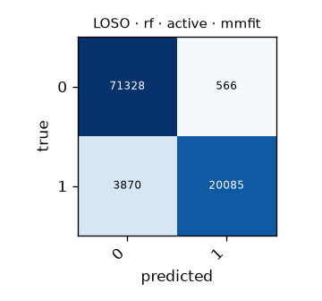

# LOSO · rf · active · mmfit

Generated by `formcoach eval loso --model rf --dataset mmfit --task active --folds loso` on 2026-09-24 16:22 · formcoach 0.1.0 · commit `033e70d` · seed 20260924

_Do not edit: regenerate with the command above (CLAUDE.md rule 3)._

- **model:** rf
- **task:** active
- **dataset:** mmfit
- **windows:** 95,849 (label purity ≥ 0.8)
- **subjects:** 10
- **class balance:** 0: 71,894, 1: 23,955
- **folds:** leave-one-subject-out

## Pooled (unseen-subject)

- accuracy **0.954** · macro-F1 **0.935** · windows 95,849 · folds 10
- per-fold macro-F1: mean 0.914, median 0.929, min 0.775

## Confusion matrix (pooled over folds)

| true \ predicted | 0 | 1 |
|---|---|---|
| 0 | 71328 | 566 |
| 1 | 3870 | 20085 |

## Per fold

| fold | n_test | accuracy | macro_f1 |
|---|---|---|---|
| P0 | 24254 | 0.976 | 0.971 |
| P1 | 27819 | 0.955 | 0.940 |
| P2 | 7813 | 0.926 | 0.884 |
| P3 | 4420 | 0.976 | 0.951 |
| P4 | 5127 | 0.966 | 0.948 |
| P5 | 5004 | 0.915 | 0.885 |
| P6 | 4152 | 0.952 | 0.937 |
| P7 | 7862 | 0.964 | 0.921 |
| P8 | 3319 | 0.832 | 0.775 |
| P9 | 6079 | 0.952 | 0.922 |
