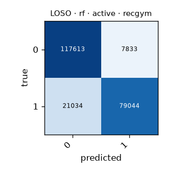

# LOSO · rf · active · recgym

Generated by `formcoach eval loso --model rf --dataset recgym --task active --folds loso` on 2026-09-24 17:11 · formcoach 0.1.0 · commit `033e70d` · seed 20260924

_Do not edit: regenerate with the command above (CLAUDE.md rule 3)._

- **model:** rf
- **task:** active
- **dataset:** recgym
- **windows:** 225,524 (label purity ≥ 0.8)
- **subjects:** 10
- **class balance:** 0: 125,446, 1: 100,078
- **folds:** leave-one-subject-out

## Pooled (unseen-subject)

- accuracy **0.872** · macro-F1 **0.868** · windows 225,524 · folds 10
- per-fold macro-F1: mean 0.867, median 0.872, min 0.813

## Confusion matrix (pooled over folds)

| true \ predicted | 0 | 1 |
|---|---|---|
| 0 | 117613 | 7833 |
| 1 | 21034 | 79044 |

## Per fold

| fold | n_test | accuracy | macro_f1 |
|---|---|---|---|
| G1 | 20717 | 0.875 | 0.874 |
| G10 | 20694 | 0.906 | 0.903 |
| G2 | 27873 | 0.886 | 0.877 |
| G3 | 22967 | 0.875 | 0.873 |
| G4 | 21828 | 0.847 | 0.844 |
| G5 | 22410 | 0.872 | 0.869 |
| G6 | 22697 | 0.859 | 0.845 |
| G7 | 23900 | 0.902 | 0.899 |
| G8 | 21713 | 0.871 | 0.870 |
| G9 | 20725 | 0.819 | 0.813 |
