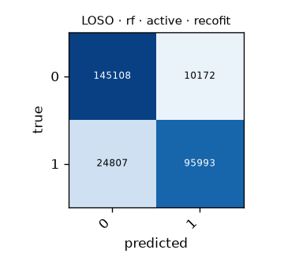

# LOSO · rf · active · recofit

Generated by `formcoach eval loso --model rf --dataset recofit --task active --folds loso` on 2026-09-27 20:14 · formcoach 0.1.0 · commit `7663796` · seed 20260924

_Do not edit: regenerate with the command above (CLAUDE.md rule 3)._

- **model:** rf
- **task:** active
- **dataset:** recofit
- **windows:** 276,080 (label purity ≥ 0.8)
- **subjects:** 94
- **class balance:** 0: 155,280, 1: 120,800
- **folds:** leave-one-subject-out

## Pooled (unseen-subject)

- accuracy **0.873** · macro-F1 **0.869** · windows 276,080 · folds 94
- per-fold macro-F1: mean 0.863, median 0.873, min 0.700

## Confusion matrix (pooled over folds)

| true \ predicted | 0 | 1 |
|---|---|---|
| 0 | 145108 | 10172 |
| 1 | 24807 | 95993 |

## Per fold

| fold | n_test | accuracy | macro_f1 |
|---|---|---|---|
| R10001 | 1587 | 0.964 | 0.960 |
| R10002 | 3430 | 0.941 | 0.940 |
| R10003 | 1325 | 0.974 | 0.970 |
| R10004 | 5028 | 0.945 | 0.945 |
| R10005 | 5298 | 0.951 | 0.951 |
| R10006 | 1262 | 0.939 | 0.937 |
| R13 | 1210 | 0.894 | 0.894 |
| R15 | 1925 | 0.839 | 0.838 |
| R17 | 2096 | 0.801 | 0.799 |
| R201 | 2359 | 0.920 | 0.883 |
| R203 | 2333 | 0.904 | 0.874 |
| R216 | 2452 | 0.721 | 0.721 |
| R218 | 2323 | 0.879 | 0.868 |
| R223 | 2047 | 0.854 | 0.845 |
| R224 | 2697 | 0.743 | 0.703 |
| R228 | 2046 | 0.759 | 0.757 |
| R229 | 1921 | 0.768 | 0.750 |
| R23 | 7710 | 0.903 | 0.893 |
| R230 | 2096 | 0.737 | 0.729 |
| R231 | 2982 | 0.911 | 0.911 |
| R232 | 1889 | 0.878 | 0.878 |
| R233 | 2173 | 0.887 | 0.882 |
| R235 | 2143 | 0.844 | 0.835 |
| R236 | 1515 | 0.859 | 0.859 |
| R238 | 2439 | 0.843 | 0.829 |
| R239 | 1341 | 0.894 | 0.894 |
| R240 | 1708 | 0.806 | 0.793 |
| R241 | 2307 | 0.820 | 0.801 |
| R242 | 1792 | 0.844 | 0.844 |
| R244 | 1640 | 0.810 | 0.808 |
| R246 | 1847 | 0.813 | 0.803 |
| R247 | 3867 | 0.917 | 0.916 |
| R248 | 5929 | 0.906 | 0.905 |
| R252 | 1315 | 0.877 | 0.876 |
| R253 | 1270 | 0.887 | 0.887 |
| R28 | 1974 | 0.767 | 0.761 |
| R3 | 10957 | 0.886 | 0.882 |
| R31 | 2147 | 0.790 | 0.778 |
| R454 | 3632 | 0.889 | 0.888 |
| R502 | 5917 | 0.893 | 0.893 |
| R506 | 1807 | 0.868 | 0.858 |
| R509 | 5433 | 0.887 | 0.887 |
| R512 | 4004 | 0.887 | 0.884 |
| R517 | 1967 | 0.861 | 0.856 |
| R525 | 7063 | 0.849 | 0.844 |
| R526 | 5089 | 0.887 | 0.881 |
| R528 | 3159 | 0.729 | 0.700 |
| R530 | 1642 | 0.876 | 0.876 |
| R531 | 2624 | 0.838 | 0.822 |
| R532 | 2492 | 0.848 | 0.834 |
| R533 | 3085 | 0.856 | 0.856 |
| R534 | 3041 | 0.761 | 0.748 |
| R535 | 2844 | 0.793 | 0.778 |
| R536 | 5931 | 0.872 | 0.871 |
| R537 | 2705 | 0.800 | 0.798 |
| R539 | 964 | 0.813 | 0.805 |
| R541 | 2146 | 0.787 | 0.787 |
| R542 | 2836 | 0.867 | 0.859 |
| R543 | 6034 | 0.825 | 0.825 |
| R545 | 2132 | 0.821 | 0.810 |
| R546 | 2238 | 0.833 | 0.828 |
| R547 | 2497 | 0.849 | 0.833 |
| R549 | 2457 | 0.934 | 0.934 |
| R550 | 2511 | 0.859 | 0.858 |
| R551 | 2527 | 0.715 | 0.713 |
| R555 | 2253 | 0.798 | 0.783 |
| R556 | 2521 | 0.881 | 0.875 |
| R559 | 2024 | 0.849 | 0.847 |
| R560 | 4048 | 0.860 | 0.860 |
| R561 | 1992 | 0.829 | 0.829 |
| R564 | 2211 | 0.930 | 0.929 |
| R567 | 2473 | 0.885 | 0.879 |
| R570 | 4485 | 0.913 | 0.910 |
| R575 | 1520 | 0.932 | 0.932 |
| R576 | 2965 | 0.829 | 0.828 |
| R579 | 5653 | 0.917 | 0.915 |
| R590 | 2511 | 0.937 | 0.937 |
| R62 | 2535 | 0.970 | 0.957 |
| R64 | 2502 | 0.952 | 0.939 |
| R66 | 2623 | 0.950 | 0.935 |
| R67 | 2709 | 0.954 | 0.939 |
| R69 | 1860 | 0.850 | 0.847 |
| R71 | 2710 | 0.934 | 0.896 |
| R72 | 1574 | 0.933 | 0.926 |
| R73 | 2034 | 0.925 | 0.919 |
| R74 | 2101 | 0.941 | 0.930 |
| R75 | 1850 | 0.956 | 0.951 |
| R76 | 6171 | 0.881 | 0.865 |
| R77 | 2118 | 0.954 | 0.947 |
| R80 | 1803 | 0.979 | 0.977 |
| R81 | 9806 | 0.857 | 0.853 |
| R82 | 2634 | 0.927 | 0.924 |
| R83 | 2248 | 0.936 | 0.913 |
| R84 | 2989 | 0.953 | 0.932 |
