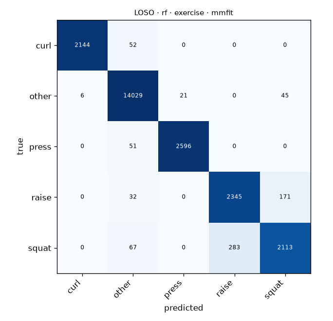

# LOSO · rf · exercise · mmfit

Generated by `formcoach eval loso --model rf --dataset mmfit --task exercise --folds loso` on 2026-09-24 16:23 · formcoach 0.1.0 · commit `033e70d` · seed 20260924

_Do not edit: regenerate with the command above (CLAUDE.md rule 3)._

- **model:** rf
- **task:** exercise
- **dataset:** mmfit
- **windows:** 23,955 (label purity ≥ 0.8)
- **subjects:** 10
- **class balance:** other: 14,101, press: 2,647, raise: 2,548, squat: 2,463, curl: 2,196
- **folds:** leave-one-subject-out

## Pooled (unseen-subject)

- accuracy **0.970** · macro-F1 **0.950** · windows 23,955 · folds 10
- per-fold macro-F1: mean 0.851, median 0.861, min 0.599

## Confusion matrix (pooled over folds)

| true \ predicted | curl | other | press | raise | squat |
|---|---|---|---|---|---|
| curl | 2144 | 52 | 0 | 0 | 0 |
| other | 6 | 14029 | 21 | 0 | 45 |
| press | 0 | 51 | 2596 | 0 | 0 |
| raise | 0 | 32 | 0 | 2345 | 171 |
| squat | 0 | 67 | 0 | 283 | 2113 |

## Per fold

| fold | n_test | accuracy | macro_f1 |
|---|---|---|---|
| P0 | 6966 | 0.999 | 0.999 |
| P1 | 7363 | 0.993 | 0.992 |
| P2 | 1803 | 0.903 | 0.747 |
| P3 | 676 | 0.990 | 0.792 |
| P4 | 1098 | 0.994 | 0.992 |
| P5 | 1392 | 0.862 | 0.747 |
| P6 | 1136 | 0.992 | 0.992 |
| P7 | 1179 | 0.958 | 0.931 |
| P8 | 1089 | 0.905 | 0.724 |
| P9 | 1253 | 0.895 | 0.599 |
