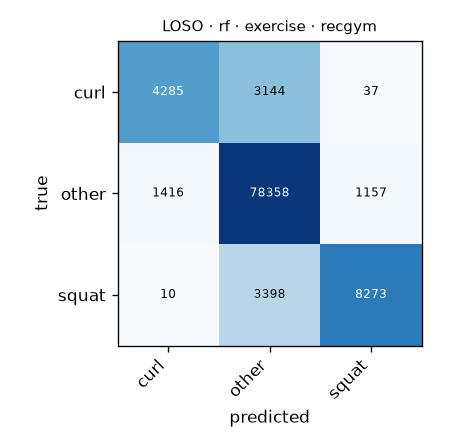

# LOSO · rf · exercise · recgym

Generated by `formcoach eval loso --model rf --dataset recgym --task exercise --folds loso` on 2026-09-24 17:13 · formcoach 0.1.0 · commit `033e70d` · seed 20260924

_Do not edit: regenerate with the command above (CLAUDE.md rule 3)._

- **model:** rf
- **task:** exercise
- **dataset:** recgym
- **windows:** 100,078 (label purity ≥ 0.8)
- **subjects:** 10
- **class balance:** other: 80,931, squat: 11,681, curl: 7,466
- **folds:** leave-one-subject-out

## Pooled (unseen-subject)

- accuracy **0.908** · macro-F1 **0.793** · windows 100,078 · folds 10
- per-fold macro-F1: mean 0.787, median 0.790, min 0.738

## Confusion matrix (pooled over folds)

| true \ predicted | curl | other | squat |
|---|---|---|---|
| curl | 4285 | 3144 | 37 |
| other | 1416 | 78358 | 1157 |
| squat | 10 | 3398 | 8273 |

## Per fold

| fold | n_test | accuracy | macro_f1 |
|---|---|---|---|
| G1 | 9870 | 0.887 | 0.743 |
| G10 | 8770 | 0.902 | 0.738 |
| G2 | 10917 | 0.923 | 0.846 |
| G3 | 10963 | 0.885 | 0.740 |
| G4 | 10207 | 0.925 | 0.844 |
| G5 | 10037 | 0.927 | 0.807 |
| G6 | 8893 | 0.884 | 0.766 |
| G7 | 10106 | 0.923 | 0.811 |
| G8 | 10927 | 0.916 | 0.798 |
| G9 | 9388 | 0.908 | 0.782 |
