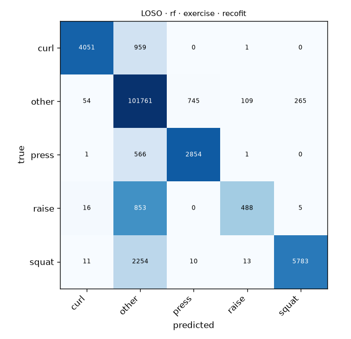

# LOSO · rf · exercise · recofit

Generated by `formcoach eval loso --model rf --dataset recofit --task exercise --folds loso` on 2026-09-24 17:04 · formcoach 0.1.0 · commit `033e70d` · seed 20260924

_Do not edit: regenerate with the command above (CLAUDE.md rule 3)._

- **model:** rf
- **task:** exercise
- **dataset:** recofit
- **windows:** 120,800 (label purity ≥ 0.8)
- **subjects:** 94
- **class balance:** other: 102,934, squat: 8,071, curl: 5,011, press: 3,422, raise: 1,362
- **folds:** leave-one-subject-out

## Pooled (unseen-subject)

- accuracy **0.951** · macro-F1 **0.797** · windows 120,800 · folds 94
- per-fold macro-F1: mean 0.630, median 0.614, min 0.265

## Confusion matrix (pooled over folds)

| true \ predicted | curl | other | press | raise | squat |
|---|---|---|---|---|---|
| curl | 4051 | 959 | 0 | 1 | 0 |
| other | 54 | 101761 | 745 | 109 | 265 |
| press | 1 | 566 | 2854 | 1 | 0 |
| raise | 16 | 853 | 0 | 488 | 5 |
| squat | 11 | 2254 | 10 | 13 | 5783 |

## Per fold

| fold | n_test | accuracy | macro_f1 |
|---|---|---|---|
| R10001 | 530 | 0.913 | 0.390 |
| R10002 | 1509 | 0.991 | 0.785 |
| R10003 | 398 | 0.962 | 0.568 |
| R10004 | 2560 | 0.975 | 0.723 |
| R10005 | 2313 | 0.978 | 0.733 |
| R10006 | 550 | 0.967 | 0.745 |
| R13 | 646 | 0.998 | 0.797 |
| R15 | 917 | 0.985 | 0.762 |
| R17 | 1037 | 0.953 | 0.664 |
| R201 | 549 | 0.812 | 0.265 |
| R203 | 591 | 0.975 | 0.567 |
| R216 | 1422 | 0.990 | 0.771 |
| R218 | 917 | 0.997 | 0.793 |
| R223 | 853 | 0.972 | 0.738 |
| R224 | 1118 | 0.906 | 0.482 |
| R228 | 1080 | 0.936 | 0.646 |
| R229 | 815 | 0.985 | 0.748 |
| R23 | 2745 | 0.991 | 0.933 |
| R230 | 922 | 0.928 | 0.555 |
| R231 | 1472 | 0.967 | 0.595 |
| R232 | 1016 | 0.975 | 0.758 |
| R233 | 902 | 0.956 | 0.688 |
| R235 | 933 | 0.995 | 0.788 |
| R236 | 776 | 0.994 | 0.791 |
| R238 | 981 | 0.990 | 0.771 |
| R239 | 679 | 0.996 | 0.793 |
| R240 | 752 | 0.989 | 0.773 |
| R241 | 902 | 0.986 | 0.763 |
| R242 | 936 | 0.997 | 0.794 |
| R244 | 805 | 0.998 | 0.794 |
| R246 | 849 | 0.945 | 0.611 |
| R247 | 1806 | 0.960 | 0.693 |
| R248 | 3427 | 0.968 | 0.675 |
| R252 | 669 | 0.988 | 0.774 |
| R253 | 693 | 1.000 | 0.800 |
| R28 | 975 | 0.995 | 0.788 |
| R3 | 4695 | 0.966 | 0.716 |
| R31 | 967 | 0.996 | 0.788 |
| R454 | 1803 | 0.935 | 0.600 |
| R502 | 3050 | 0.971 | 0.757 |
| R506 | 659 | 0.886 | 0.587 |
| R509 | 2792 | 0.905 | 0.708 |
| R512 | 1799 | 0.957 | 0.617 |
| R517 | 860 | 0.984 | 0.769 |
| R525 | 3217 | 0.956 | 0.729 |
| R526 | 1939 | 0.944 | 0.651 |
| R528 | 1459 | 0.888 | 0.452 |
| R530 | 860 | 0.960 | 0.733 |
| R531 | 984 | 0.992 | 0.779 |
| R532 | 961 | 0.958 | 0.695 |
| R533 | 1590 | 0.889 | 0.470 |
| R534 | 1317 | 0.923 | 0.553 |
| R535 | 1209 | 0.926 | 0.570 |
| R536 | 2806 | 0.957 | 0.800 |
| R537 | 1333 | 0.857 | 0.541 |
| R539 | 457 | 1.000 | 0.400 |
| R541 | 1202 | 0.888 | 0.485 |
| R542 | 1157 | 0.949 | 0.643 |
| R543 | 3145 | 0.955 | 0.805 |
| R545 | 928 | 0.931 | 0.494 |
| R546 | 1034 | 0.896 | 0.552 |
| R547 | 989 | 0.947 | 0.576 |
| R549 | 1188 | 0.959 | 0.595 |
| R550 | 1342 | 0.988 | 0.762 |
| R551 | 1289 | 0.979 | 0.740 |
| R555 | 936 | 0.864 | 0.433 |
| R556 | 982 | 0.875 | 0.489 |
| R559 | 936 | 0.877 | 0.514 |
| R560 | 2090 | 0.941 | 0.560 |
| R561 | 1116 | 0.876 | 0.388 |
| R564 | 1227 | 0.949 | 0.382 |
| R567 | 1012 | 0.912 | 0.591 |
| R570 | 2652 | 0.947 | 0.408 |
| R575 | 778 | 0.988 | 0.381 |
| R576 | 1522 | 0.933 | 0.508 |
| R579 | 2253 | 0.925 | 0.513 |
| R590 | 1239 | 0.956 | 0.519 |
| R62 | 560 | 0.932 | 0.469 |
| R64 | 635 | 0.992 | 0.591 |
| R66 | 656 | 0.962 | 0.553 |
| R67 | 686 | 0.920 | 0.486 |
| R69 | 892 | 0.997 | 0.793 |
| R71 | 562 | 0.916 | 0.523 |
| R72 | 564 | 0.906 | 0.369 |
| R73 | 762 | 0.954 | 0.540 |
| R74 | 666 | 0.998 | 0.598 |
| R75 | 649 | 0.994 | 0.593 |
| R76 | 2195 | 0.978 | 0.901 |
| R77 | 656 | 0.979 | 0.578 |
| R80 | 664 | 0.997 | 0.596 |
| R81 | 4611 | 0.933 | 0.794 |
| R82 | 1102 | 0.841 | 0.293 |
| R83 | 503 | 0.998 | 0.598 |
| R84 | 618 | 0.908 | 0.387 |
