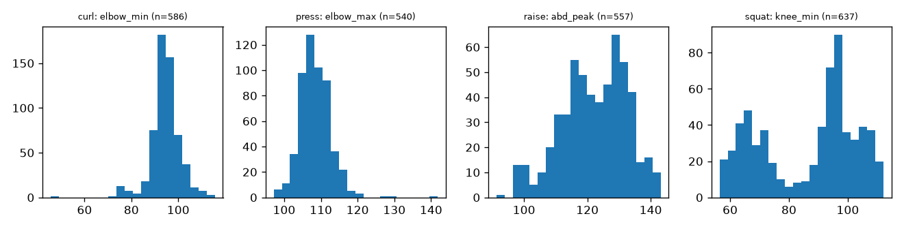

# Rules validation (rules.yaml on MM-Fit 3-D pose)

Generated by `formcoach eval rules` on 2026-09-24 17:40 · formcoach 0.1.0 · commit `984e4eb` · seed 20260924

_Do not edit: regenerate with the command above (CLAUDE.md rule 3)._

- **rules:** src/formcoach/rules/rules.yaml
- **pose source:** mmfit-pose3d (Human3.6M 17 joints, lifted from video)
- **reps:** 2320
- **sets:** 239

## Rep segmentation (adaptive pose thresholds vs MM-Fit set counts)

| exercise | sets | reps_true | reps_pose | mae | exact_pct |
|---|---|---|---|---|---|
| curl | 59 | 599 | 586 | 0.22 | 91.53 |
| press | 60 | 598 | 540 | 0.97 | 5.00 |
| raise | 56 | 559 | 557 | 0.04 | 98.21 |
| squat | 64 | 639 | 637 | 0.03 | 96.88 |

## Pass rate per rule (MM-Fit reps taken as correct form; low = fires on normal reps)

| exercise | rule | reps | flagged | pass_rate | condition |
|---|---|---|---|---|---|
| curl | CURL_PARTIAL_ROM | 586 | 586 | 0.000 | elbow_min gt 75 or elbow_max lt 140 |
| curl | CURL_SWING | 586 | 0 | 1.000 | upper_arm_trunk_drift gt 20 or elbow_drift_max gt 0.15 |
| curl | CURL_TOO_FAST | 586 | 210 | 0.642 | duration_s lt 1 |
| curl | CURL_ASYMMETRY | 586 | 586 | 0.000 | elbow_asymmetry gt 20 |
| press | PRESS_NO_LOCKOUT | 540 | 540 | 0.000 | elbow_max lt 155 |
| press | PRESS_TRUNK_LEAN | 540 | 313 | 0.420 | trunk_incl_max gt 15 |
| press | PRESS_ASYMMETRY | 540 | 22 | 0.959 | elbow_top_asymmetry gt 20 |
| press | PRESS_TOO_FAST | 540 | 53 | 0.902 | duration_s lt 1 |
| raise | RAISE_OVER | 557 | 537 | 0.036 | abd_peak gt 100 |
| raise | RAISE_PARTIAL | 557 | 0 | 1.000 | abd_peak lt 65 |
| raise | RAISE_BENT_ELBOW | 557 | 499 | 0.104 | elbow_at_abd_peak lt 140 |
| raise | RAISE_TOO_FAST | 557 | 111 | 0.801 | duration_s lt 1 |
| squat | SQUAT_SHALLOW | 637 | 342 | 0.463 | knee_min gt 110 or hip_knee_height_at_bottom gt 0 |
| squat | SQUAT_FORWARD_LEAN | 637 | 0 | 1.000 | trunk_incl_at_bottom gt 45 |
| squat | SQUAT_KNEE_VALGUS | 637 | 44 | 0.931 | knee_track_at_bottom lt -0.1 |
| squat | SQUAT_TOO_FAST | 637 | 546 | 0.143 | duration_s lt 1.2 |

## Perturbation detection (synthetic faults applied to the same reps)

| exercise | perturbation | expected | reps | detected | detection_rate |
|---|---|---|---|---|---|
| curl | rom_x0.7 | CURL_PARTIAL_ROM | 586 | 586 | 1.000 |
| curl | elbow_shift_0.2 | CURL_SWING | 586 | 586 | 1.000 |
| curl | speed_x2 | CURL_TOO_FAST | 586 | 586 | 1.000 |
| press | press_no_lockout | PRESS_NO_LOCKOUT | 540 | 540 | 1.000 |
| press | press_trunk_lean_25 | PRESS_TRUNK_LEAN | 540 | 540 | 1.000 |
| raise | raise_bent_elbow | RAISE_BENT_ELBOW | 557 | 557 | 1.000 |
| raise | raise_partial | RAISE_PARTIAL | 557 | 202 | 0.363 |
| squat | squat_shallow | SQUAT_SHALLOW | 637 | 596 | 0.936 |
| squat | trunk_lean_25 | SQUAT_FORWARD_LEAN | 637 | 122 | 0.192 |
| squat | knee_valgus | SQUAT_KNEE_VALGUS | 637 | 355 | 0.557 |
| squat | squat_speed_x2 | SQUAT_TOO_FAST | 637 | 637 | 1.000 |

## Metric distributions on correct-form reps (5th / 50th / 95th percentile)

| exercise | metric | n | p5 | median | p95 |
|---|---|---|---|---|---|
| squat | duration_s | 637 | 0.73 | 0.94 | 1.31 |
| squat | elbow_min | 637 | 41.04 | 90.00 | 116.91 |
| squat | elbow_max | 637 | 52.73 | 114.42 | 132.54 |
| squat | upper_arm_trunk_drift | 637 | 4.71 | 20.59 | 61.30 |
| squat | elbow_drift_max | 637 | 0.00 | 0.06 | 0.19 |
| squat | trunk_incl_max | 637 | 6.23 | 12.36 | 27.61 |
| squat | abd_peak | 637 | 64.25 | 106.59 | 139.19 |
| squat | elbow_at_abd_peak | 637 | 45.71 | 96.66 | 120.61 |
| squat | knee_min | 637 | 60.52 | 93.13 | 108.57 |
| squat | trunk_incl_at_bottom | 637 | 3.27 | 11.15 | 25.99 |
| squat | knee_track_at_bottom | 637 | -0.13 | 0.04 | 0.25 |
| squat | elbow_top_asymmetry | 637 | 0.92 | 7.74 | 23.15 |
| squat | hip_knee_height_at_bottom | 637 | -0.33 | 0.02 | 0.21 |
| squat | elbow_asymmetry | 637 | 0.74 | 8.50 | 25.73 |
| press | duration_s | 540 | 0.93 | 1.35 | 1.74 |
| press | elbow_min | 540 | 60.63 | 73.00 | 82.35 |
| press | elbow_max | 540 | 102.70 | 108.19 | 115.63 |
| press | upper_arm_trunk_drift | 540 | 39.34 | 50.92 | 63.60 |
| press | elbow_drift_max | 540 | 0.08 | 0.14 | 0.22 |
| press | trunk_incl_max | 540 | 6.25 | 16.25 | 26.90 |
| press | abd_peak | 540 | 145.05 | 153.48 | 160.70 |
| press | elbow_at_abd_peak | 540 | 101.10 | 107.34 | 113.80 |
| press | knee_min | 540 | 88.34 | 100.76 | 115.30 |
| press | trunk_incl_at_bottom | 540 | 1.32 | 10.54 | 23.43 |
| press | knee_track_at_bottom | 540 | -0.09 | 0.07 | 0.21 |
| press | elbow_top_asymmetry | 540 | 1.96 | 9.83 | 19.17 |
| press | hip_knee_height_at_bottom | 540 | 0.03 | 0.33 | 0.53 |
| press | elbow_asymmetry | 540 | 0.84 | 7.39 | 15.86 |
| curl | duration_s | 586 | 0.77 | 1.07 | 1.44 |
| curl | elbow_min | 586 | 85.03 | 94.33 | 103.87 |
| curl | elbow_max | 586 | 128.08 | 133.44 | 139.68 |
| curl | upper_arm_trunk_drift | 586 | 1.66 | 3.79 | 7.45 |
| curl | elbow_drift_max | 586 | 0.00 | 0.02 | 0.06 |
| curl | trunk_incl_max | 586 | 1.50 | 3.21 | 9.15 |
| curl | abd_peak | 586 | 30.67 | 39.32 | 53.39 |
| curl | elbow_at_abd_peak | 586 | 86.17 | 95.40 | 104.76 |
| curl | knee_min | 586 | 164.86 | 169.47 | 173.02 |
| curl | trunk_incl_at_bottom | 586 | 0.34 | 1.41 | 5.98 |
| curl | knee_track_at_bottom | 586 | -0.15 | -0.08 | -0.00 |
| curl | elbow_top_asymmetry | 586 | 5.72 | 18.62 | 32.25 |
| curl | hip_knee_height_at_bottom | 586 | 1.02 | 1.11 | 1.18 |
| curl | elbow_asymmetry | 586 | 73.41 | 86.57 | 98.71 |
| raise | duration_s | 557 | 0.77 | 1.34 | 1.64 |
| raise | elbow_min | 557 | 95.45 | 124.32 | 138.87 |
| raise | elbow_max | 557 | 131.36 | 143.10 | 157.38 |
| raise | upper_arm_trunk_drift | 557 | 29.81 | 53.41 | 63.09 |
| raise | elbow_drift_max | 557 | 0.05 | 0.10 | 0.17 |
| raise | trunk_incl_max | 557 | 9.75 | 21.58 | 30.85 |
| raise | abd_peak | 557 | 101.98 | 122.73 | 137.36 |
| raise | elbow_at_abd_peak | 557 | 96.64 | 124.89 | 141.13 |
| raise | knee_min | 557 | 87.14 | 97.01 | 111.17 |
| raise | trunk_incl_at_bottom | 557 | 0.92 | 6.43 | 22.88 |
| raise | knee_track_at_bottom | 557 | -0.23 | 0.05 | 0.25 |
| raise | elbow_top_asymmetry | 557 | 0.75 | 8.01 | 22.34 |
| raise | hip_knee_height_at_bottom | 557 | -0.39 | -0.02 | 0.37 |
| raise | elbow_asymmetry | 557 | 0.43 | 5.36 | 15.83 |

