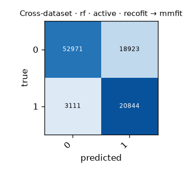

# Cross-dataset · rf · active · recofit → mmfit

Generated by `formcoach eval loso --model rf --dataset recofit --task active --test-dataset mmfit` on 2026-09-24 17:05 · formcoach 0.1.0 · commit `033e70d` · seed 20260924

_Do not edit: regenerate with the command above (CLAUDE.md rule 3)._

- **model:** rf
- **task:** active
- **dataset:** recofit
- **windows:** 276,080 (label purity ≥ 0.8)
- **subjects:** 94
- **class balance:** 0: 155,280, 1: 120,800
- **test dataset:** mmfit (95,849 windows, 10 subjects)
- **folds:** train on all of --dataset, test per subject of --test-dataset

## Pooled (unseen-subject)

- accuracy **0.770** · macro-F1 **0.741** · windows 95,849 · folds 10
- per-fold macro-F1: mean 0.715, median 0.719, min 0.594

## Confusion matrix (pooled over folds)

| true \ predicted | 0 | 1 |
|---|---|---|
| 0 | 52971 | 18923 |
| 1 | 3111 | 20844 |

## Per fold

| fold | n_test | accuracy | macro_f1 |
|---|---|---|---|
| P0 | 24254 | 0.792 | 0.778 |
| P1 | 27819 | 0.799 | 0.772 |
| P2 | 7813 | 0.752 | 0.713 |
| P3 | 4420 | 0.705 | 0.634 |
| P4 | 5127 | 0.784 | 0.744 |
| P5 | 5004 | 0.748 | 0.722 |
| P6 | 4152 | 0.731 | 0.711 |
| P7 | 7862 | 0.665 | 0.594 |
| P8 | 3319 | 0.746 | 0.717 |
| P9 | 6079 | 0.805 | 0.760 |
