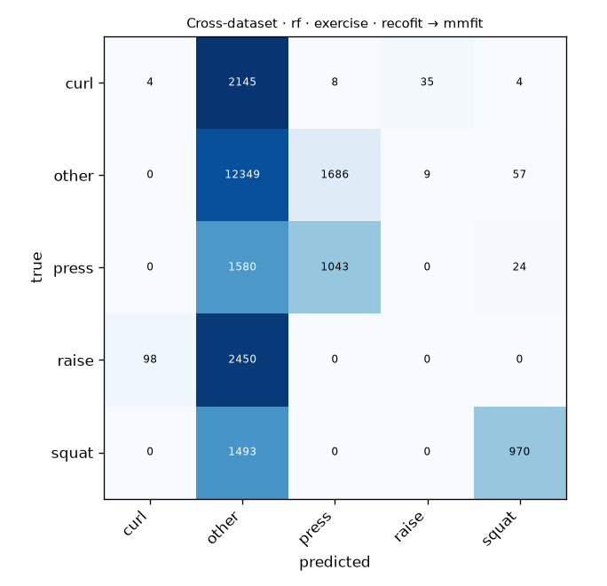

# Cross-dataset · rf · exercise · recofit → mmfit

Generated by `formcoach eval loso --model rf --dataset recofit --task exercise --test-dataset mmfit` on 2026-09-24 17:06 · formcoach 0.1.0 · commit `033e70d` · seed 20260924

_Do not edit: regenerate with the command above (CLAUDE.md rule 3)._

- **model:** rf
- **task:** exercise
- **dataset:** recofit
- **windows:** 120,800 (label purity ≥ 0.8)
- **subjects:** 94
- **class balance:** other: 102,934, squat: 8,071, curl: 5,011, press: 3,422, raise: 1,362
- **test dataset:** mmfit (23,955 windows, 10 subjects)
- **folds:** train on all of --dataset, test per subject of --test-dataset

## Pooled (unseen-subject)

- accuracy **0.600** · macro-F1 **0.333** · windows 23,955 · folds 10
- per-fold macro-F1: mean 0.300, median 0.248, min 0.147

## Confusion matrix (pooled over folds)

| true \ predicted | curl | other | press | raise | squat |
|---|---|---|---|---|---|
| curl | 4 | 2145 | 8 | 35 | 4 |
| other | 0 | 12349 | 1686 | 9 | 57 |
| press | 0 | 1580 | 1043 | 0 | 24 |
| raise | 98 | 2450 | 0 | 0 | 0 |
| squat | 0 | 1493 | 0 | 0 | 970 |

## Per fold

| fold | n_test | accuracy | macro_f1 |
|---|---|---|---|
| P0 | 6966 | 0.670 | 0.445 |
| P1 | 7363 | 0.534 | 0.221 |
| P2 | 1803 | 0.581 | 0.258 |
| P3 | 676 | 0.766 | 0.445 |
| P4 | 1098 | 0.638 | 0.407 |
| P5 | 1392 | 0.567 | 0.238 |
| P6 | 1136 | 0.528 | 0.212 |
| P7 | 1179 | 0.682 | 0.417 |
| P8 | 1089 | 0.565 | 0.211 |
| P9 | 1253 | 0.557 | 0.147 |
